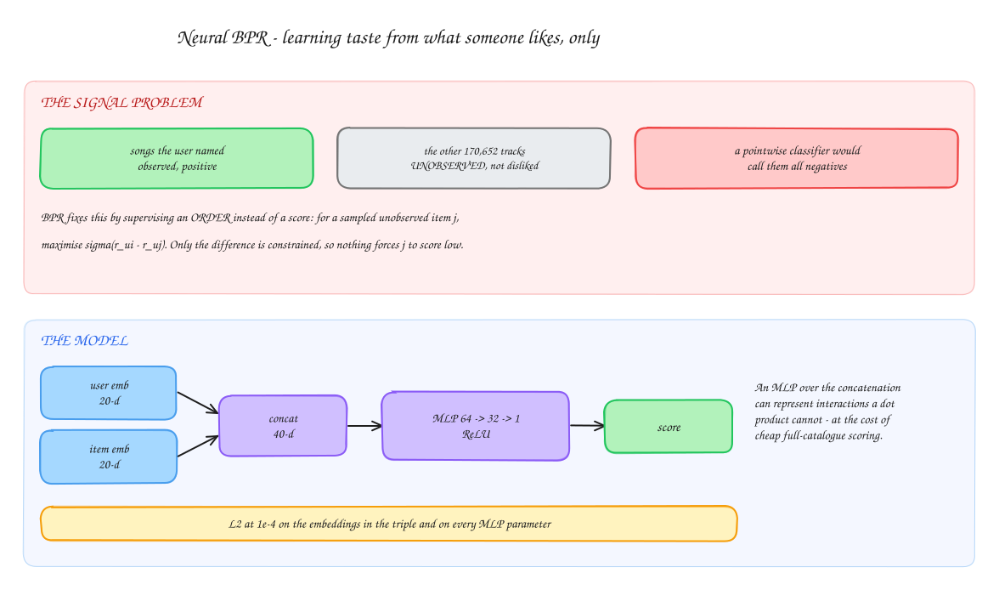
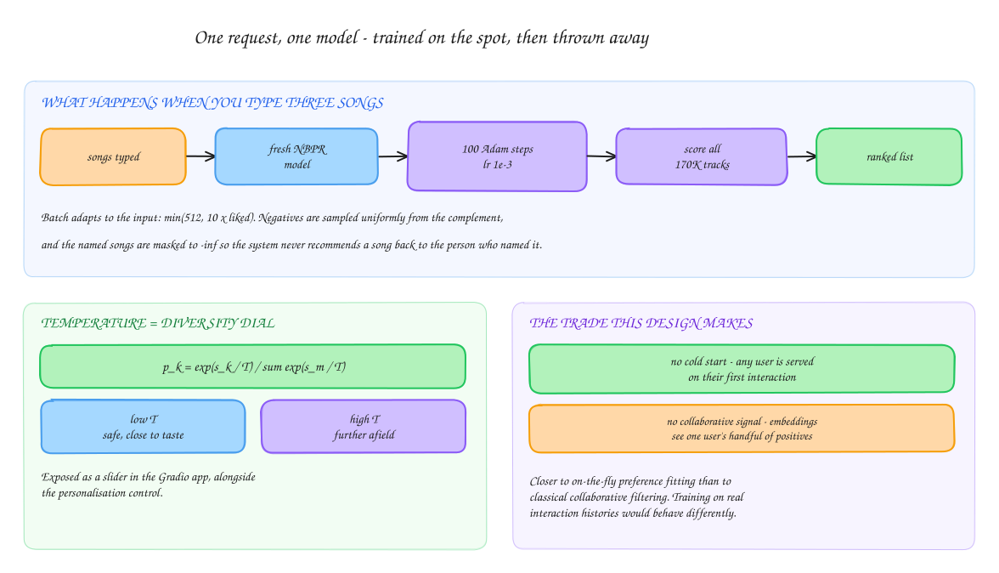

# Neural BPR Music Recommendation

A music recommender trained on **implicit** preferences using Neural Bayesian Personalized
Ranking. You type a handful of songs you like; the system trains a small ranking model on
the spot against sampled negatives from the rest of the catalogue and returns a ranked
list. A temperature control governs how far recommendations drift from the stated taste.
The whole thing runs behind a Gradio interface.

Catalogue: a Spotify dataset of **170,653 tracks** with per-track audio features.

> Course project — AI & ML, IIT Bombay · Guide: Lt. Prof. Pushpak Bhattacharyya

---

## Why pairwise ranking

<p align="center">
  
</p>

<sub>Editable source: [`docs/model.excalidraw`](docs/model.excalidraw) — open at [excalidraw.com](https://excalidraw.com)</sub>

The available signal is one-sided: a user names songs they like and says nothing about
songs they dislike. Treating the other 170,652 tracks as negatives and fitting a pointwise
classifier would be wrong — an unnamed song is *unobserved*, not disliked.

BPR sidesteps this by supervising an ordering instead of a score. For a user `u`, an
observed item `i` and a sampled unobserved item `j`:

```
L = -(1/|B|) Σ log σ(r_ui - r_uj)  +  λ ||Θ||²
```

Only the **difference** is constrained, so nothing forces `j` to be scored low in absolute
terms — exactly the property implicit feedback needs.

### The model (`class NBPR`)

- User and item embedding tables, `emb_dim = 20`, initialised `N(0, 0.01²)`
- Concatenated to 40-d, then an MLP `64 → 32 → 1` with ReLU
- L2 at `1e-4` on the embeddings in the triple and on every MLP parameter

An MLP over the concatenation represents user–item interactions a dot product cannot, at
the cost of the dot product's cheap full-catalogue scoring.

---

## One request, one model

<p align="center">
  
</p>

`RecommenderSystem.train_on_input()` builds a **fresh single-user model per request** and
trains it for 100 Adam steps at `lr=1e-3`. Batch size adapts to the input:
`min(512, 10 × liked)`. Positives are sampled with replacement from the named songs,
negatives uniformly from the complement.

All items are then scored in one batched pass under `torch.no_grad()`, with the named songs
masked to `-inf` so the system never recommends a song back to the person who named it.

**Temperature.** Scores become probabilities through a tempered softmax,
`p_k = exp(s_k / T) / Σ exp(s_m / T)`. Low `T` sharpens toward the highest-scoring tracks
(safe, close to stated taste); high `T` flattens the distribution and admits more distant
tracks. This is the diversity slider in the UI.

**The trade this makes.** There is no pre-trained global model and no stored user table, so
cold start disappears — any user is served on their first interaction. In exchange, item
embeddings are learned from one user's handful of positives rather than from co-listening
signal across users, which makes this closer to on-the-fly preference fitting than to
classical collaborative filtering.

---

## Repository structure

```
.
├── neural_BPR.ipynb                # Model, recommender and Gradio app
├── 23b0917_23b0970.ipynb           # Submitted notebook (same content)
├── Music_Recommendation_System.ipynb
├── data.csv                        # 170,653 tracks with audio features
├── data_by_genres.csv
├── data_by_year.csv
└── docs/                           # README diagrams (.svg) + Excalidraw sources
```

## Running it

Open `neural_BPR.ipynb` (Colab or Jupyter), point `load_and_preprocess()` at `data.csv`,
and run all cells. The final cell launches the Gradio app: enter a comma-separated list of
songs, adjust the diversity and personalisation controls, and the trained model returns
song, artist, score and probability.

Dependencies: `torch`, `pandas`, `numpy`, `gradio`.

---

## Limitations

- **No offline evaluation.** No held-out split and no NDCG, recall@k or MAP — there is no
  measurement of whether the recommendations are good, only that they are produced.
- **No collaborative signal.** With one synthetic user per request, embeddings cannot
  capture co-listening structure across users.
- **Content features unused.** The catalogue carries valence, energy, danceability, tempo
  and more, plus the by-genre and by-year tables. A hybrid model is the obvious next step.
- **Fixed 100 iterations.** No convergence check or early stopping.
- **Full-catalogue scoring.** Every request scores all 170K items through the MLP, which
  bounds scaling without an approximate-nearest-neighbour candidate stage.
